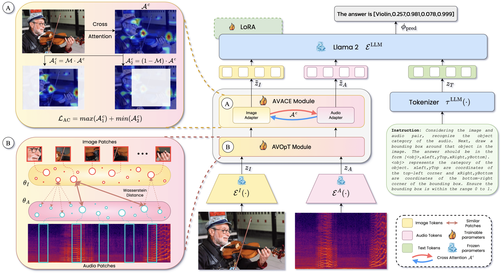

<div align="center">
  
</div>


# Meerkat: Audio-Visual Large Language Model for Grounding in Space and Time
  
<!-- **Authors:** -->

<div align="center">
  
<b>_<sup>1*</sup> [Sanjoy Chowdhury](https://schowdhury671.github.io/), <sup>2*</sup> [Sayan Nag](https://sayannag.github.io/), <sup>3*</sup> [Subhrajyoti Dasgupta](https://subhrajyotidasgupta.github.io/), <sup>4</sup>[Jun Chen](https://junchen14.github.io/),_</b>

**_<sup>4</sup> [Mohamed Elhoseiny](https://www.mohamed-elhoseiny.com/), <sup>1</sup> [Ruohan Gao](https://ruohangao.github.io/), <sup>1</sup> [Dinesh Manocha](https://www.cs.umd.edu/people/dmanocha/)_**

<!-- **Affiliations:** -->

_<sup>1</sup> University of Maryland, <sup>2</sup> University of Toronto, <sup>3</sup> Mila and Université de Montréal, <sup>4</sup> KAUST_
</div>

Meerkat is an audio-visual LLM equipped with a fine-grained understanding of image 🖼️ and audio 🎵 both spatially 🪐 and temporally 🕒.

#### 📰 <a href="https://arxiv.org/abs/2407.01851" style="color: black; text-decoration: underline;text-decoration-style: dotted;">Paper</a>    :card_file_box:  <a href="https://umd0-my.sharepoint.com/:f:/g/personal/sanjoyc_umd_edu/Esxw8RUgg5tNuBWwHEB3jrUBINIl3clrKRRc6n-TErWYEQ?e=bARrBP" style="color: black; text-decoration: underline;text-decoration-style: dotted;">Dataset</a>   🌐  <a href="https://schowdhury671.github.io/meerkat_project/" style="color: black; text-decoration: underline;text-decoration-style: dotted;">Project Page</a>    :bricks: [Code](https://github.com/schowdhury671/meerkat/tree/main)    

## Table of Contents 📚

- [Model Architecture](#model-architecture)
- [Installation](#installation)
- [Usage](#usage)
- [Results](#results)
- [Acknowledgements](#acknowledgments)

## Model Architecture 💡
<div align="center">
  
</div>


## Installation 🛠️

To install Meerkat, follow these steps:

```bash
# Clone the repository
git clone https://github.com/lyuchenyang/Macaw-LLM.git

# Change to the Macaw-LLM directory
cd Macaw-LLM

# Install required packages
pip install -r requirements.txt

# Install ffmpeg
yum install ffmpeg -y

# Install apex
git clone https://github.com/NVIDIA/apex.git
cd apex
python setup.py install
cd ..
```

## Usage 🚀

1. **Downloading dataset:** 
   - Please download the dataset JSONs from here: [Sharepoint Link](https://umd0-my.sharepoint.com/personal/sanjoyc_umd_edu/_layouts/15/onedrive.aspx?id=%2Fpersonal%2Fsanjoyc%5Fumd%5Fedu%2FDocuments%2FAVFIT%20dataset&ga=1)


2. **Dataset preprocessing:** 
   - Extract frames and audio from videos
   - The JSONs and data files should be placed following the directory structure:
   ```
   data
   |--<dataset>
        |--<dataset>_train.json 
        |--<dataset_test>.json
        |--frames
              |--<image>.jpg
              |-- ...
        |--audios
              |--<audio>.wav
              |-- ...
   ```
   - Transform supervised data to dataset: 
     ```
     python preprocess_data_supervised.py
     ```
     
3. **Training:** 
   - Execute the training script (you can specify the training parameters inside):
     ```
     ./train.sh
     ```

4. **Inference:** 
   - Execute the inference script (you can give any customized inputs inside):
     ```
     ./inference.sh
     ```

## Results 📉
<div align="center">
  
</div>


## Acknowledgements 🙏

We would like to express our gratitude to the following open-source projects for their valuable contributions to Meerkat:

- [Macaw-LLM](https://github.com/lyuchenyang/Macaw-LLM) for providing a building block for this project.


## Citation

```bibtex
@article{chowdhury2024meerkat,
      title={Meerkat: Audio-Visual Large Language Model for Grounding in Space and Time},
      author={Chowdhury, Sanjoy and Nag, Sayan and Dasgupta, Subhrajyoti and Chen, Jun and Elhoseiny, Mohamed and Gao, Ruohan and Manocha, Dinesh},
      journal={ECCV},
      year={2024}
}
```
